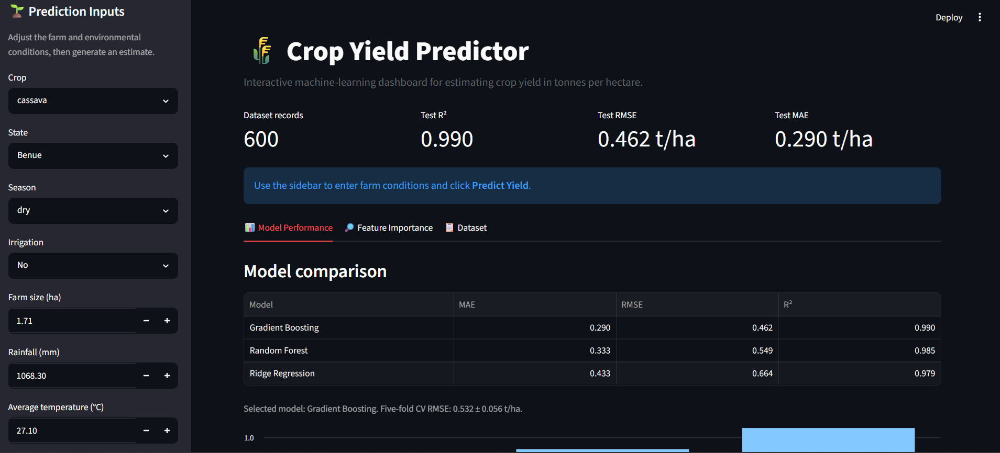
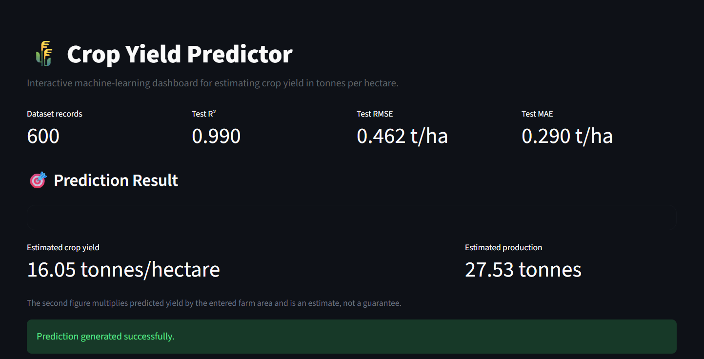
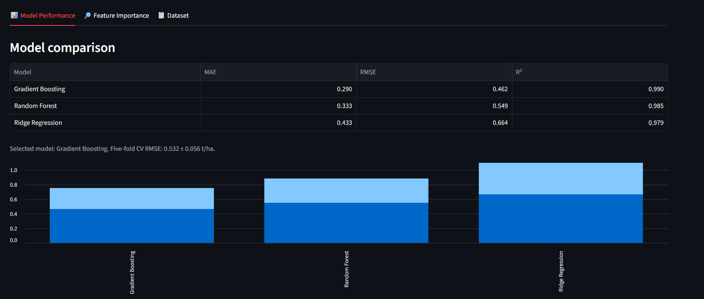
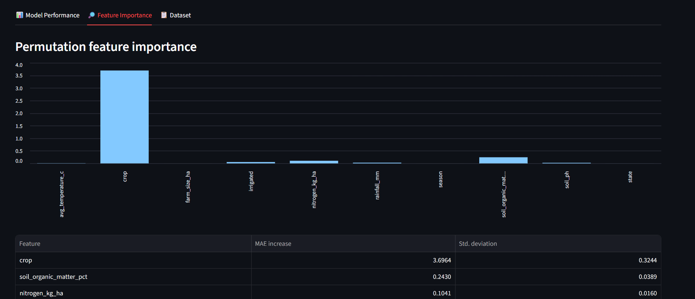
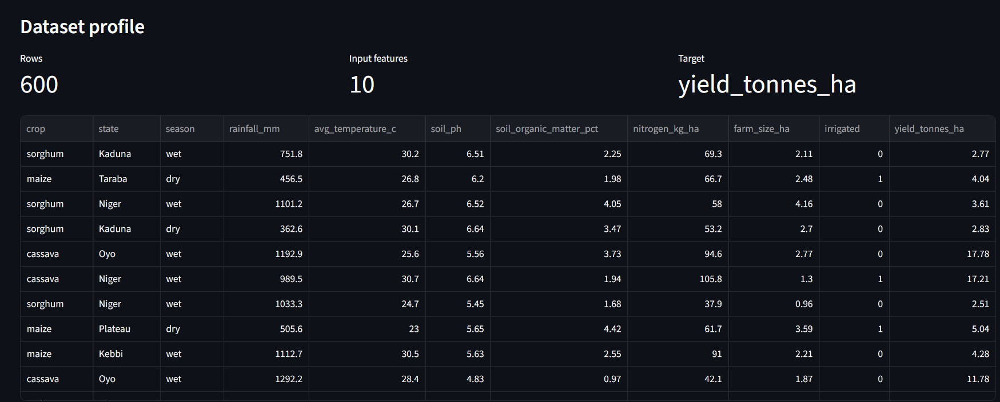
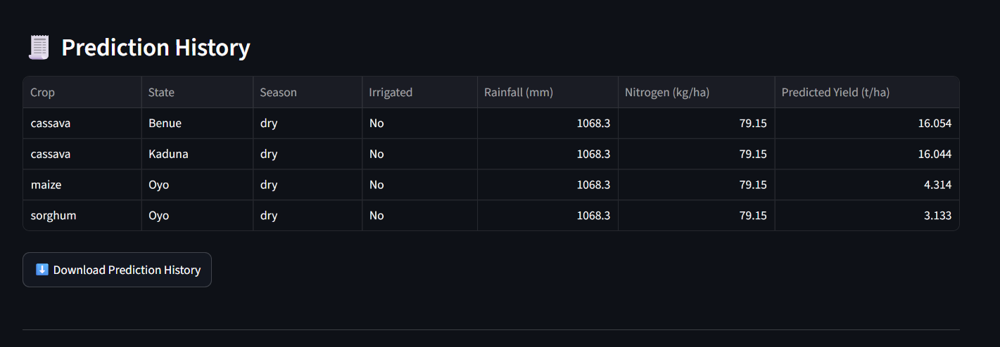

# 🌾 Crop Yield Prediction


A reproducible machine-learning capstone for estimating **crop yield in
tonnes per hectare** from crop, location, season, weather, soil,
nutrient, farm-size, and irrigation variables.

## Project Overview

This project builds and evaluates regression models for crop-yield
estimation and provides an interactive Streamlit application for
demonstration.

The current pipeline compares **Ridge Regression, Random Forest, and
Gradient Boosting** using a consistent preprocessing workflow. Gradient
Boosting is currently selected because it achieved the best holdout
RMSE.

> **Responsible-use note:** This is an educational and portfolio
> project. The supplied dataset has 600 observations and should not be
> treated as independently validated field data. Predictions are not
> agronomic advice or yield guarantees.

## Objectives

-   Build a reproducible crop-yield regression pipeline.
-   Compare multiple regression algorithms.
-   Use consistent preprocessing for numeric and categorical variables.
-   Evaluate performance with MAE, RMSE, and R².
-   Check stability with five-fold cross-validation.
-   Interpret model reliance using permutation importance.
-   Provide an interactive Streamlit prediction interface.

## Dataset

The repository contains `data/crop_yield_prediction.csv`.

**Shape:** 600 rows × 11 columns.

### Predictor variables

  Category         Variables
  ---------------- -----------------------------------------------
  Crop/location    `crop`, `state`, `season`
  Weather          `rainfall_mm`, `avg_temperature_c`
  Soil             `soil_ph`, `soil_organic_matter_pct`
  Farm/nutrients   `nitrogen_kg_ha`, `farm_size_ha`, `irrigated`
  Target           `yield_tonnes_ha`

The repository also contains `data/crop_yield_sample.csv`, generated by
`src/generate_data.py` as a reproducible demonstration dataset.

## Machine Learning Workflow

``` text
CSV Dataset
    ↓
Schema & Data Validation
    ↓
Train/Test Split (80/20, random_state=42)
    ↓
Preprocessing
 ┌─────────────────────────┐
 │ Numeric: impute + scale │
 │ Categorical: impute +   │
 │ one-hot encode          │
 └─────────────────────────┘
    ↓
Model Comparison
 ├── Ridge Regression
 ├── Random Forest
 └── Gradient Boosting
    ↓
Holdout Evaluation
    ↓
5-Fold Cross-Validation
    ↓
Permutation Importance
    ↓
Persisted Best Model
    ↓
Streamlit Application
```

## Model Performance

Results from the current fixed 20% holdout set:

  Model                     MAE (t/ha)   RMSE (t/ha)          R²
  ----------------------- ------------ ------------- -----------
  **Gradient Boosting**      **0.290**     **0.462**   **0.990**
  Random Forest                  0.333         0.548       0.985
  Ridge Regression               0.433         0.664       0.979

### Cross-validation

The selected Gradient Boosting model achieved:

**5-fold CV RMSE: 0.530 ± 0.057 tonnes/hectare**

The difference between holdout and cross-validation performance
reinforces why both views are reported.

## Feature Importance

Permutation importance on the holdout set currently indicates that the
model relies most heavily on:

  Feature                       MAE Increase
  --------------------------- --------------
  `crop`                               3.696
  `soil_organic_matter_pct`            0.243
  `nitrogen_kg_ha`                     0.104
  `irrigated`                          0.053
  `rainfall_mm`                        0.029

Permutation importance indicates model reliance; it does **not** prove
causal relationships.

## Installation

### 1. Clone the repository

``` bash
git clone https://github.com/4peace1/Crop-Yield-Prediction.git
cd Crop-Yield-Prediction
```

### 2. Create a virtual environment

Windows:

``` bash
python -m venv .venv
.venv\Scripts\activate
```

macOS/Linux:

``` bash
python3 -m venv .venv
source .venv/bin/activate
```

### 3. Install dependencies

``` bash
python -m pip install -r requirements.txt
```

## Train the Model

From the repository root:

``` bash
python src/train.py
```

Or specify another compatible CSV:

``` bash
python src/train.py --data data/crop_yield_prediction.csv
```

Training produces:

``` text
models/crop_yield_model.joblib
reports/evaluation.json
reports/model_comparison.csv
reports/feature_importance.csv
```

## Run the Streamlit Application

``` bash
python -m streamlit run app.py
```

The application accepts the same feature schema used during training and
returns an estimated yield in tonnes/hectare.

## Command-Line Prediction

Run:

``` bash
python src/predict.py --help
```

The command accepts the crop, state, season, irrigation status, weather,
soil, nutrient, and farm-size inputs required by the trained model.

## Notebook

The main walkthrough is:

``` text
notebooks/crop_yield_prediction.ipynb
```

It covers:

-   Dataset profiling
-   Missing-value checks
-   Target distribution
-   Crop-level yield patterns
-   Model comparison
-   Five-fold cross-validation
-   Permutation importance
-   Final results

## Project Structure

``` text
Crop-Yield-Prediction/
├── app.py
├── README.md
├── requirements.txt
├── .gitignore
├── LICENSE
├── data/
│   ├── crop_yield_prediction.csv
│   └── crop_yield_sample.csv
├── models/
│   └── crop_yield_model.joblib
├── notebooks/
│   └── crop_yield_prediction.ipynb
├── reports/
│   ├── evaluation.json
│   ├── model_comparison.csv
│   └── feature_importance.csv
├── src/
│   ├── generate_data.py
│   ├── model.py
│   ├── predict.py
│   └── train.py
└── tests/
    ├── test_model.py
    └── test_repository.py
```

## Automated Testing

The repository includes automated tests for dataset validation, expected
feature schema, model fitting, prediction output, and required project
files.

Run the test suite from the repository root:

``` bash
python -m pytest -q
```

For a Python syntax check:

``` bash
python -m compileall -q app.py src tests
```

The current test suite passes successfully.

## 📸 Application Screenshots

### 🌾 Interactive Dashboard

The Streamlit application provides an interactive interface for entering farm and environmental conditions, reviewing model performance, and generating crop-yield estimates.



### 🎯 Crop Yield Prediction

The application generates an estimated crop yield from the selected farm and environmental conditions. It also estimates total production using the entered farm size.



### 📊 Model Performance

Gradient Boosting achieved the best holdout performance among the evaluated models, with an R² of 0.990 and RMSE of 0.462 tonnes/hectare.



### 🔎 Feature Importance

Permutation importance shows which input variables have the greatest influence on predictive performance. It measures model reliance and should not be interpreted as causality.



### 📋 Dataset Profile

The application provides an interactive view of the modelling dataset, containing 600 observations, 10 input features, and the target variable `yield_tonnes_ha`.



### 🧾 Prediction History

Predictions generated during the current session are recorded in a history table and can be exported as a CSV file.



## Limitations and Validation Risks

1.  The dataset contains only 600 observations.
2.  Dataset provenance and representativeness should be verified
    independently.
3.  The test split is useful for development but is not a substitute for
    external validation.
4.  The high R² should not be interpreted as proof of real-world
    generalization.
5.  Crop identity is highly influential in the current model, so
    performance should be examined separately by crop.
6.  The project has not been validated on independent Nigerian farm
    observations.
7.  Model outputs should not be used alone for operational agricultural
    decisions.

## Future Improvements

-   [ ] Add an independently sourced external validation dataset.
-   [ ] Perform grouped or stratified validation by crop and state.
-   [ ] Tune Gradient Boosting hyperparameters systematically.
-   [ ] Add prediction intervals or uncertainty estimates.
-   [ ] Add richer EDA and residual diagnostics.
-   [ ] Add experiment tracking.
-   [ ] Deploy the Streamlit application after external validation.
-   [ ] Add model monitoring for future production use.

## Capstone Context

This project demonstrates:

-   Data validation and preprocessing
-   Regression model development
-   Model comparison
-   Cross-validation
-   Model evaluation
-   Feature interpretation
-   Model persistence
-   Command-line inference
-   Interactive Streamlit deployment
-   Reproducible project organization

## Author

**Sunday Babatunde Israel**

Fellow ID: FE/26/2850020886

Email: 4peace1@gmail.com

GitHub: [4peace1](https://github.com/4peace1)

## License

This project is licensed under the MIT License. See
[`LICENSE`](LICENSE).

------------------------------------------------------------------------

**Capstone project --- Crop Yield Prediction using Machine Learning**
